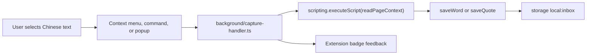

# 拾语汉字box

拾语汉字box is a local-first Chrome MV3 extension for collecting Chinese words,
phrases, and quotes while reading. Select text on a page, save it as a word or a
quote, keep the working inbox in local extension storage, and export daily
Markdown notes.

The project is built with WXT, React, TypeScript, Tailwind CSS, Vitest, and
`@webext-core/fake-browser`.

## Current Status

Implemented:

- WXT MV3 scaffold with React, Tailwind, Vitest, and Chrome permissions.
- Typed entry model for words, quotes, occurrences, and inbox storage.
- Chinese-oriented text normalization for word dedupe.
- Local `chrome.storage.local` inbox wrapper with serialized write updates.
- Core capture logic:
  - words dedupe by normalized text and append source occurrences;
  - quotes are saved as independent entries;
  - empty selections are ignored.
- Page-context reader for selected text, surrounding text, title, URL, and domain.
- Background service worker wiring for context menus and keyboard commands.
- Toolbar popup buttons for saving the current selection as a word or quote.
- Lazy pinyin generation with `pinyin-pro`.
- Daily Markdown rendering and zip export helpers.
- Versioned JSON backup export and validated restore import for the full local
  inbox.
- New-tab dashboard with search, status filters, cards, edit controls, pinyin,
  export actions, and backup/restore controls.
- Offline Word Insight Panel with CC-CEDICT definitions, tone chips, source
  examples, external dictionary links, and review reveal mode.
- Jade/ink Tailwind theme tokens and CJK font stack.
- Unit tests for normalization, capture/dedupe, background capture paths,
  pinyin, Markdown rendering, export generation, and backup restore validation.

## Word Insight Panel

Expanding a saved word in the dashboard shows:

- **Tone chips** — one per Chinese character, with tone marks and numbers.
- **Definitions** — from the bundled CC-CEDICT offline dictionary.
- **Component fallback** — for phrases with no exact match, definitions for
  the component characters.
- **Source examples** — the captured surrounding sentences with the word
  highlighted, deduped to the newest three.
- **External links** — click-only links to MDBG (Chinese-English) and
  百度汉语 (Chinese-Chinese). Nothing is fetched until you click.

Review cards gain a **显示释义** reveal button so you can test yourself before
seeing pinyin and definitions.

### Dictionary Attribution

Definitions come from [CC-CEDICT](https://www.mdbg.net/chinese/dictionary?page=cc-cedict),
licensed CC-BY-SA. See `docs/dictionaries/CC-CEDICT.md` for details and update
instructions. The dictionary ships as a compact offline asset; the extension
never contacts MDBG at runtime.

### Privacy

The Word Insight Panel is fully offline. The only outbound requests are the
two external dictionary links, and only when you click them.

## How Capture Works



Words and quotes share common metadata such as `id`, `text`, `note`, `status`,
`createdAt`, `updatedAt`, and optional `pinyin`.

Words also store a `normalized` dedupe key and an `occurrences[]` list containing
source page metadata. Quotes store source metadata directly, keep optional tags,
and are not deduped.

## Project Layout

```text
entrypoints/
  background/
    index.ts             # registers context menus and commands
    capture-handler.ts   # active-tab selection capture + badge feedback
  popup/
    index.html
    main.tsx
    Popup.tsx            # save as word / save as quote buttons
  newtab/
    index.html
    main.tsx
    App.tsx              # dashboard shell, filters, list wiring
    hooks/useInbox.ts    # live WXT storage hook
    components/          # toolbar, word/quote cards, lists, pinyin button
lib/
  capture.ts             # saveWord/saveQuote and word dedupe behavior
  export.ts              # export map + zip generation
  backup.ts              # versioned JSON backup + restore validation
  id.ts                  # dependency-free id generation
  markdown.ts            # daily note rendering
  normalize.ts           # word normalization
  page-context.ts        # injected selection reader
  pinyin.ts              # pinyin-pro wrapper
  storage.ts             # WXT storage item and serialized mutations
  types.ts               # persisted data shapes
tests/
  capture-handler.test.ts
  capture.test.ts
  export.test.ts
  markdown.test.ts
  normalize.test.ts
  pinyin.test.ts
```

Design and implementation planning live under `docs/superpowers/`.

## Development

Install dependencies:

```bash
npm install
```

Run the extension dev server:

```bash
npm run dev
```

Build the Chrome MV3 extension:

```bash
npm run build
```

Build output is written to `.output/chrome-mv3/`. Load that directory as an
unpacked extension in Chrome.

Run tests:

```bash
npm test
```

Typecheck:

```bash
npm run compile
```

Create a distributable zip:

```bash
npm run zip
```

## To Do

- Add capture undo and clearer save feedback after context menu, shortcut, and
  popup captures.
- Add review settings such as daily cap, interval presets, and review streak
  visibility.

## Useful Notes

- The manifest is configured in `wxt.config.ts`.
- The storage import path for this WXT version is `wxt/utils/storage`.
- WXT browser types are imported as `Browser` from `wxt/browser`; tab types are
  `Browser.tabs.Tab`.
- The base extension icon lives at `assets/icon.png`; WXT auto-icons generates
  the packed icon sizes during build.

## Test Coverage

The current test suite covers:

- normalization rules and idempotence;
- first word capture, normalized word dedupe, duplicate occurrence suppression,
  quote capture, and empty-input handling;
- background capture success, no-selection, restricted-page, no-active-tab, and
  quote paths using fake Chrome APIs;
- local pinyin generation;
- daily Markdown frontmatter, sections, words, quotes, quote tags, pinyin, and
  source links;
- daily export grouping, archived-entry skipping, and zip byte generation.
- versioned backup JSON generation, legacy raw inbox restore, and invalid import
  rejection.
