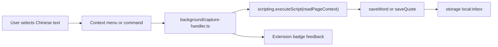

# 拾语汉字box

拾语汉字box is a local-first Chrome MV3 extension for collecting Chinese words,
phrases, and quotes while reading. Select text on a page, save it as a word or a
quote, keep the working inbox in local extension storage, and eventually export
daily Markdown notes.

The project is built with WXT, React, TypeScript, Tailwind CSS, Vitest, and
`@webext-core/fake-browser`.

## Current Status

Implemented:

- WXT MV3 scaffold with React, Tailwind, Vitest, and Chrome permissions.
- Typed entry model for words, quotes, occurrences, and inbox storage.
- Chinese-oriented text normalization for word dedupe.
- Local `chrome.storage.local` inbox wrapper with serialized write updates.
- Core capture logic:
  - words dedupe by normalized text and append source occurrences;
  - quotes are saved as independent entries;
  - empty selections are ignored.
- Page-context reader for selected text, surrounding text, title, URL, and domain.
- Background service worker wiring for context menus and keyboard commands.
- Unit tests for normalization, capture/dedupe, and background capture paths.

Still planned:

- Toolbar popup save buttons.
- Pinyin generation module.
- Markdown and zip export.
- New-tab dashboard and inbox components.
- Tailwind theme polish and Chrome manual smoke test.

## How Capture Works



Words and quotes share common metadata such as `id`, `text`, `tags`, `note`,
`status`, `createdAt`, `updatedAt`, and optional `pinyin`.

Words also store a `normalized` dedupe key and an `occurrences[]` list containing
source page metadata. Quotes store source metadata directly and are not deduped.

## Project Layout

```text
entrypoints/
  background/
    index.ts             # registers context menus and commands
    capture-handler.ts   # active-tab selection capture + badge feedback
  popup/
    index.html
    main.tsx             # placeholder until the full popup task lands
lib/
  capture.ts             # saveWord/saveQuote and word dedupe behavior
  id.ts                  # dependency-free id generation
  normalize.ts           # word normalization
  page-context.ts        # injected selection reader
  storage.ts             # WXT storage item and serialized mutations
  types.ts               # persisted data shapes
tests/
  capture-handler.test.ts
  capture.test.ts
  normalize.test.ts
```

Design and implementation planning live under `docs/superpowers/`.

## Development

Install dependencies:

```bash
npm install
```

Run the extension dev server:

```bash
npm run dev
```

Build the Chrome MV3 extension:

```bash
npm run build
```

Build output is written to `.output/chrome-mv3/`. Load that directory as an
unpacked extension in Chrome.

Run tests:

```bash
npm test
```

Typecheck:

```bash
npm run compile
```

Create a distributable zip:

```bash
npm run zip
```

## Useful Notes

- The manifest is configured in `wxt.config.ts`.
- The storage import path for this WXT version is `wxt/utils/storage`.
- WXT browser types are imported as `Browser` from `wxt/browser`; tab types are
  `Browser.tabs.Tab`.
- The build currently warns that auto-icons has no `assets/icon.png`; WXT still
  produces default generated icons.
- The popup is still a placeholder and is expected to be replaced by the Task 7
  implementation.

## Test Coverage

The current test suite covers:

- normalization rules and idempotence;
- first word capture, normalized word dedupe, duplicate occurrence suppression,
  quote capture, and empty-input handling;
- background capture success, no-selection, restricted-page, no-active-tab, and
  quote paths using fake Chrome APIs.
