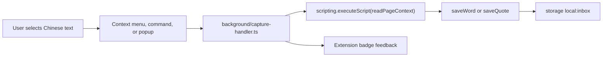

# 拾语汉字box

拾语汉字box is a local-first Chrome MV3 extension for collecting Chinese words,
phrases, and quotes while reading. Select text on a page, save it as a word or a
quote, keep the working inbox in local extension storage, and export daily
Markdown notes.

The project is built with WXT, React, TypeScript, Tailwind CSS, Vitest, and
`@webext-core/fake-browser`.

## Current Status

Implemented:

- WXT MV3 scaffold with React, Tailwind, Vitest, and Chrome permissions.
- Typed entry model for words, quotes, occurrences, and inbox storage.
- Chinese-oriented text normalization for word dedupe.
- Local `chrome.storage.local` inbox wrapper with serialized write updates.
- Core capture logic:
  - words dedupe by normalized text and append source occurrences;
  - quotes are saved as independent entries;
  - empty selections are ignored.
- Page-context reader for selected text, surrounding text, title, URL, and domain.
- Background service worker wiring for context menus and keyboard commands.
- Toolbar popup buttons for saving the current selection as a word or quote.
- Lazy pinyin generation with `pinyin-pro`.
- Daily Markdown rendering and zip export helpers.
- Versioned JSON backup export and validated restore import for the full local
  inbox.
- Dashboard page opened from the toolbar popup or extension action menu, with
  search, status filters, cards, edit controls, pinyin, export actions, and
  backup/restore controls.
- Focused one-card-at-a-time spaced repetition for saved words and quotes,
  with FSRS scheduling, local review analytics, and configurable retention/new
  card limits.
- One-click Simplified to Taiwan Traditional conversion on word and quote cards,
  powered by OpenCC and cached on each entry.
- Offline Word Insight Panel with CC-CEDICT definitions, tone chips, source
  examples, external dictionary links, and review reveal mode.
- One-click Mandarin pronunciation for saved words through Chrome/OS Chinese
  text-to-speech voices, with browser Web Speech fallback.
- Opt-in AI Insight layer with BYO API key, provider picker, generated bilingual
  notes persisted on words, and Markdown/backup/review integration.
- Settings page with English / zh-CN UI locale selection, full AI provider
  configuration, and optional dictionary controls.
- Optional runtime Kaikki JSONL import/download into local IndexedDB storage for
  extra dictionary fallback entries without growing the packed extension.
- Jade/ink Tailwind theme tokens and CJK font stack.
- Unit tests for normalization, capture/dedupe, background capture paths,
  pinyin, Markdown rendering, export generation, and backup restore validation.

## Word Insight Panel

Expanding a saved word in the dashboard shows:

- **Tone chips** — one per Chinese character, with tone marks and numbers.
- **Pronunciation** — click the speaker button to hear the saved word.
- **Definitions** — from the bundled CC-CEDICT offline dictionary.
- **Component fallback** — for phrases with no exact match, definitions for
  the component characters.
- **Source examples** — the captured surrounding sentences with the word
  highlighted, deduped to the newest three.
- **External links** — click-only links to Youdao (Chinese-English) and
  百度汉语 (Chinese-Chinese). Nothing is fetched until you click.

In the Review tab, one large card is shown at a time. Word cards keep pinyin,
definitions, notes, examples, pronunciation, and AI insight behind
**Reveal / 查看答案**. Quote cards show their saved text and note immediately.

### Pronunciation (TTS)

Word cards, expanded word insight, and review reveal include a speaker button.
Clicking it reads the saved Simplified Chinese word aloud using a `zh-CN` voice
when available, with another `zh-*` voice as fallback. Clicking the active
speaker button stops playback; clicking another word replaces the current
utterance.

Pronunciation requires no API key and stores no audio or playback state. The
extension prefers Chrome's `tts` API and falls back to the browser Web Speech
API. Speech is handled by the operating system or a speech engine installed in
Chrome. Depending on the user's configured voice, that engine may use a remote
speech service.

### Traditional Chinese Conversion

Word and quote cards include a small **繁** conversion control. The first click
converts the saved entry text from Simplified Chinese to Taiwan-style
Traditional Chinese using `opencc-js` with the `cn -> twp` phrase config, then
caches the result on the entry as `traditionalText`. After conversion, the same
control toggles the Traditional rendering on or off for the current dashboard
session.

The conversion is local and synchronous. It does not add permissions, make
network requests, affect capture dedupe, or change Markdown/zip exports.

### AI Insight (opt-in)

The word card's expanded panel offers an "Ask AI" button that generates
structured bilingual definitions, sample sentences, collocations, and usage
notes. This is an **opt-in feature**: it requires a user-supplied API key and
does not run until you click the button.

How it works:

1. Open **Settings** from the dashboard toolbar, then use the **AI 设置** section.
2. Choose a provider: DeepSeek, OpenAI, or a custom OpenAI-compatible endpoint.
3. Paste your API key and select a model.
4. Click **测试连接** to verify the provider settings.
5. Expand any word card and click **Ask AI**.

Privacy:

- The API key is stored in `chrome.storage.local` on your device only.
- AI requests send only the saved word, optional pinyin, dictionary glosses, and
  one recent occurrence to the provider you chose.
- Generated insights are persisted on the word and flow into backups, exports,
  and review cards, so you only pay for each insight once.
- When AI is disabled, the extension makes no AI provider requests.

### Dictionary Attribution

Definitions come from [CC-CEDICT](https://www.mdbg.net/chinese/dictionary?page=cc-cedict),
licensed CC-BY-SA. See `docs/dictionaries/CC-CEDICT.md` for details and update
instructions. The dictionary ships as a compact offline asset; the extension
never contacts MDBG at runtime.

### Local Dictionary Privacy

The local Word Insight sections are fully offline. The only outbound dictionary
requests are the two external dictionary links, and only when you click them.
AI requests are separate, opt-in, and use only the provider configured by you.

## Spaced repetition (Review tab)

Saved words and quotes are scheduled by the FSRS algorithm (via `ts-fsrs`),
which models each item's memory from difficulty, stability, and your target
retention.

**Review flow:** the Review tab shows one large due card at a time.

- For a **word**, the saved word is the prompt. Click **Reveal** to see pinyin,
  definitions, notes, examples, pronunciation, and AI insight.
- For a **quote**, review uses cloze deletion: a blanked span (cloze) is the
  prompt, and the hidden text is the answer. Click **Reveal** to see the blanked
  span. A quote becomes reviewable only when it has at least one cloze. Each
  cloze is an independent FSRS card. Quotes with no clozes (parked quotes) show
  an "Add a blank to review" affordance in the dashboard.

Rate the card:

- **Again** — you forgot it; it comes back soon.
- **Hard** — you recalled it with serious effort.
- **Good** — you recalled it correctly.
- **Easy** — you recalled it instantly.

The scheduler sets the next due date from your rating. After a rating or
**Postpone**, the next due card slides into place. Postpone moves the current
card to tomorrow without changing its memory state.

**Settings (Settings → Spaced repetition):**

- **Target retention** — the recall probability FSRS schedules for (default
  90%).
- **Maximum interval (days)** — cap on the longest scheduling gap.
- **New cards per day** — limits how many never-reviewed cards appear each day.
  Already-learning and due review cards are never hidden by this cap.

All review data is stored locally on each entry and travels with JSON backups.
No network access is required.

## Settings, AI, And Optional Kaikki Dictionary

Open **Settings** from the dashboard toolbar to choose the UI locale:

- `zh-CN` keeps the original Simplified Chinese interface.
- `en` switches dashboard, popup, review, insight, and settings labels to
  English. Saved words, quotes, notes, backups, and Markdown exports are never
  translated.

CC-CEDICT remains the default bundled offline dictionary. For words that
CC-CEDICT misses, the settings page can optionally extend lookup with a Kaikki
JSONL dictionary source:

- **Import JSONL file** streams a local Kaikki JSONL file through a worker,
  shows progress, and stores processed entries in IndexedDB.
- **Open Kaikki download** opens the configured Kaikki URL in a normal tab so
  you can download the JSONL manually, then import it after the download
  finishes.
- **Enable Kaikki fallback** controls whether the stored Kaikki index is used.
- **Remove Kaikki data** deletes the runtime Kaikki index and leaves the
  bundled CC-CEDICT dictionary untouched.

Kaikki data is not bundled into `public/` and is not added to the packed
extension. Large Kaikki dumps can take significant time and local browser
storage to process during import, so keep the settings page open while progress
is running. Kaikki entries are used only as fallback definitions: CC-CEDICT
results stay first when both sources contain a word.

During import, the progress panel reports imported entries and filtered records.
Filtered records are expected for Kaikki dumps: the importer only keeps unique
Chinese headwords that contain at least one Han character and at least one
usable `glosses` or `raw_glosses` definition. Kaikki also includes Chinese
records such as Latin-script loanwords, redirects, and no-gloss character
metadata; no-definition records are ignored because they cannot improve the
Hanzi fallback dictionary. Definition-bearing records can still contribute
lookup aliases from their `forms`, so Simplified variants such as `滞涨` can
resolve through Traditional Kaikki headwords such as `滯漲`.

Kaikki data comes from [Kaikki/Wiktextract](https://kaikki.org/) and its
published dictionary dumps. Review the Kaikki source page and Wiktionary license
terms before redistributing imported dictionary data.

## How Capture Works



Words and quotes share common metadata such as `id`, `text`, `note`, `status`,
`createdAt`, `updatedAt`, optional `pinyin`, and optional `traditionalText`.

Words also store a `normalized` dedupe key and an `occurrences[]` list containing
source page metadata. Quotes store source metadata directly, keep optional tags,
and are not deduped.

## Project Layout

```text
entrypoints/
  background/
    index.ts             # registers context menus and commands
    capture-handler.ts   # active-tab selection capture + badge feedback
  popup/
    index.html
    main.tsx
    Popup.tsx            # save as word / save as quote buttons
  settings/
    index.html
    main.tsx
    SettingsApp.tsx      # locale + SRS + AI + optional Kaikki settings
  dashboard/
    index.html
    main.tsx
    App.tsx              # dashboard shell, filters, list wiring
    hooks/useAiInsight.ts # AI insight request + persistence hook
    hooks/useInbox.ts    # live WXT inbox storage hook
    hooks/useSettings.ts # live WXT settings storage hook
    components/          # toolbar, word/quote cards, lists, pinyin/traditional controls
lib/
  ai/
    client.ts            # OpenAI-compatible fetch wrapper
    parse.ts             # AI JSON response validation
    permissions.ts       # lazy provider host permission requests
    prompt.ts            # prompt/message builder
    settings.ts          # local AI settings storage and presets
  capture.ts             # saveWord/saveQuote and word dedupe behavior
  export.ts              # export map + zip generation
  backup.ts              # versioned JSON backup + restore validation
  id.ts                  # dependency-free id generation
  markdown.ts            # daily note rendering
  i18n.ts                # EN/zh-CN UI messages
  kaikki.ts              # Kaikki JSONL parser and URL validation
  kaikki-cache.ts        # IndexedDB cache for runtime Kaikki indexes
  normalize.ts           # word normalization
  page-context.ts        # injected selection reader
  pinyin.ts              # pinyin-pro wrapper
  review.ts              # compatibility wrapper around the SRS queue
  srs.ts                 # FSRS adapter, migration, queue, actions, stats
  traditional.ts         # opencc-js Simplified -> Taiwan Traditional wrapper
  storage.ts             # WXT storage item and serialized mutations
  settings.ts            # WXT app settings storage and helpers
  types.ts               # persisted data shapes
tests/
  capture-handler.test.ts
  capture.test.ts
  export.test.ts
  markdown.test.ts
  normalize.test.ts
  pinyin.test.ts
  traditional.test.ts
```

The dashboard UI lives in `entrypoints/dashboard/`.

Design and implementation planning live under `docs/superpowers/`.

## Development

Install dependencies:

```bash
npm install
```

Run the extension dev server:

```bash
npm run dev
```

Build the Chrome MV3 extension:

```bash
npm run build
```

Build output is written to `.output/chrome-mv3/`. Load that directory as an
unpacked extension in Chrome.

Run tests:

```bash
npm test
```

Typecheck:

```bash
npm run compile
```

Create a distributable zip:

```bash
npm run zip
```

## To Do

- Add capture undo and clearer save feedback after context menu, shortcut, and
  popup captures.
- Add review streak visibility.

## Useful Notes

- The manifest is configured in `wxt.config.ts`.
- The storage import path for this WXT version is `wxt/utils/storage`.
- WXT browser types are imported as `Browser` from `wxt/browser`; tab types are
  `Browser.tabs.Tab`.
- The base extension icon lives at `assets/icon.png`; WXT auto-icons generates
  the packed icon sizes during build.

## Test Coverage

The current test suite covers:

- normalization rules and idempotence;
- first word capture, normalized word dedupe, duplicate occurrence suppression,
  quote capture, and empty-input handling;
- background capture success, no-selection, restricted-page, no-active-tab, and
  quote paths using fake Chrome APIs;
- local pinyin generation;
- daily Markdown frontmatter, sections, words, quotes, quote tags, pinyin,
  source links, and AI insight sections;
- daily export grouping, archived-entry skipping, and zip byte generation.
- versioned backup JSON generation, legacy raw inbox restore, and invalid import
  rejection.
- AI settings presets, permission origin requests, prompt building, response
  parsing, client error handling, component rendering, and backup round-trip.
- FSRS migration, rating schedules, learning-step persistence, daily new-card
  caps, due-time wakeups, settings normalization, and one-card review UI.
